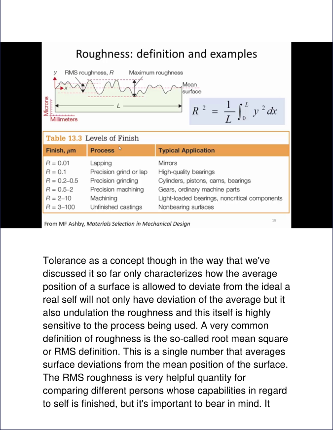
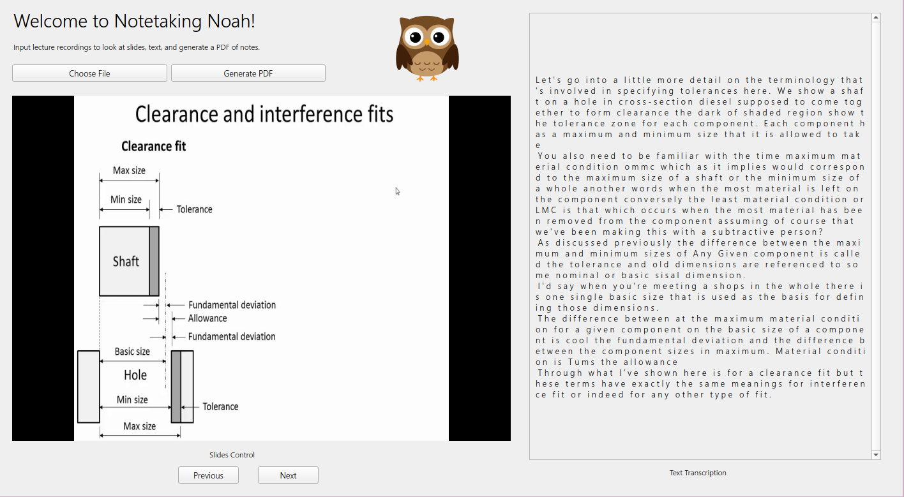

# Notetaking Noah

  
  <b>Notetaking Noah streamlines watching and reviewing lectures.</b>

  

## Inspiration
As colleges and universities shut down across the United States, millions of students have been forced to move to online video lectures. This presents many unique challenges to a university education: different time-zones often make it impossible to attend live lectures, and even those who do report a lower quality and effectiveness when compared to lectures in-person. 

In an effort to ameliorate this situation, professors often post video recordings for students in case they missed lecture or needed to review certain concepts. However, these recordings can often be lengthy, filled with frequent pauses, and difficult to comprehend. Coupled with the abundance of multimedia information typically encoded in videos (millions of frames, audio output) we believe **there must be a way to efficiently parse information from lengthy lecture recordings into concise, informative study material.**

This is why we created Notetaking Noah, an assistant powered by Google Cloud and OpenCV to process visual and audio information to **generate a deck of slides, a speech transcript, and a set of notes, all contained in a user-friendly and convenient desktop application.**

## What it does
From the desktop application, Notetaking Noah queries the user for an mp4 file of a lecture recording, and after a few seconds, outputs slides as well as an audio transcript of the lecture, both viewable in the app. Users also have the option of saving a set of notes generated by syncing a professor's audio with its corresponding slide. Lastly, the desktop application saves jpeg files of the slides for potential external usage. 

In essence, Notetaking Noah **makes both initially watching a lecture and reviewing past concepts streamlined and effortless** through providing a searchable transcript and organizing textual and pictorial material together.

## How we built it
Notetaking Noah's GUI is built using Qt Creator to organize buttons, images, and text into an interface, which is then linked to logic and back-end functions in a python script. This allows users to **efficiently input actions and receive outputs in a streamlined, easy-to-use application.**

After receiving an mp4 file, Notetaking Noah uses OpenCV to detect large changes in pixels between video frames to detect when a slide is changed, marking the timestamp and saving a photo of the slide. After this, the audio is split from the video, and is further split based on pauses to form sentences and phrases. These audio files are then given a timestamp and parsed through Google Cloud's Speech-to-Text API, saving the transcription to display later. 

Finally, the text and pictures are passed pack into the GUI, and a PDF document of notes is rendered by matching the timestamps of slides to its corresponding text.

## Challenges we ran into
None of us had experience with front-end development, so making a GUI for Notetaking Noah posed many challenges in communicating user actions (button presses, numerical inputs) into tangible back-end actions. Another challenge we faced was using OpenCV to efficiently detect differences between images as well as utilizing ReportLab to format and produce a PDF.

## Accomplishments that we're proud of
We were able to learn many powerful development tools, including Qt for creating interactive GUI experiences, as well as Google Cloud for quickly and accurately analyzing speech data. Furthermore, this project included many distinct actions, from generating PDFs to splitting audio clips, and we're proud that we were able to integrate all functionalities together in an effective and streamlined way.

## What we learned
We learned a lot about PyQT, OpenCV, Google Cloud API, ReportLab, and of course, a bunch of miscellaneous information after watching many video lectures. 

## What's next for Notetaking Noah
We can try to improve on the robustness of the Speech to Text algorithm, since it currently still misidentifies words due to accents and audio defects. Furthermore, in the future, we hope to use Natural Language Processing to identify keywords and concepts during the lecture to help students quickly find areas of interest or study certain subjects in depth.
